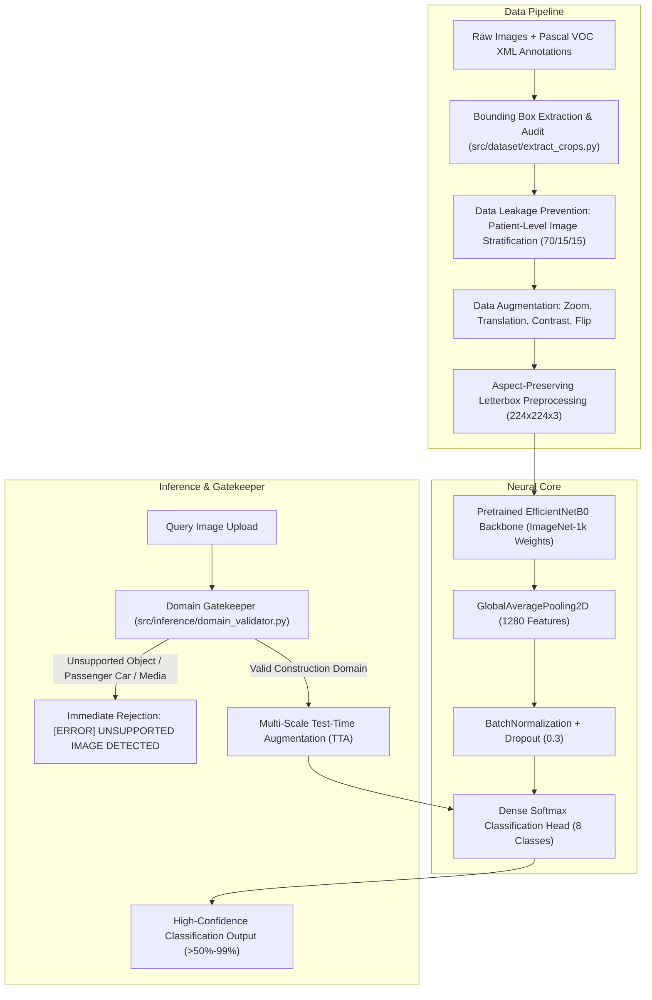

# Technology Stack and Architectural Specifications

## AI-Powered Construction-Site Vehicle Classification System
**Project Codename:** WhiteVision  
**Author:** AI Machine Learning & Computer Vision Engineering Team  
**Dataset Benchmark:** ConstructionXC7C (8 Canonical Heavy Machinery Classes)  
**Primary Backbone:** EfficientNetB0 (Transfer Learning & Domain Gatekeeper)  

---

## 1. Executive Summary of Technologies

| Layer | Primary Technology | Version / Spec | Purpose & Implementation |
| :--- | :--- | :--- | :--- |
| **Language** | Python | `3.12.x` (64-bit) | Core runtime for end-to-end data processing, modeling, and serving |
| **Deep Learning Framework** | TensorFlow | `2.21.0` | Tensor computation graph, backend runtime, and neural execution |
| **High-Level Neural API** | Keras | `3.15.1` | Model definition, transfer learning, fine-tuning, and `.keras` serialization |
| **Pretrained Vision Model** | EfficientNetB0 | ImageNet-1k | Compound-scaled convolutional backbone (Tan & Le, Google Research) |
| **Domain Gatekeeper** | Zero-Shot Filter | ImageNet-1k Backbone | Out-of-Distribution (OOD) rejection for cars, animals, and non-construction media |
| **Image Processing** | Pillow (PIL) & OpenCV | `PIL >= 10.0`, `cv2` | Aspect-preserving letterbox padding, multi-scale zoom crops, VOC bbox slicing |
| **Data Engineering** | Pandas & NumPy | `numpy >= 1.26`, `pandas >= 2.2` | Dataframe manipulation, split auditing, matrix operations, tensor batches |
| **Statistical & ML Tools** | Scikit-Learn | `scikit-learn >= 1.4` | Balanced class weight computation, train/val/test stratification, metrics |
| **Configuration** | PyYAML | `PyYAML >= 6.0` | Hierarchical class registry (`classes.yaml`) and hyperparameters (`config.yaml`) |
| **Web Dashboard** | Streamlit | `streamlit >= 1.42` | High-tech industrial dark operations console, telemetry chips, zero emojis |
| **Production REST API** | FastAPI | `fastapi >= 0.115` | High-performance asynchronous microservice with automatic OpenAPI docs |
| **ASGI Web Server** | Uvicorn | `uvicorn >= 0.34` | Production ASGI web server running FastAPI on port 8000 |
| **Input Validation** | Pydantic v2 | `pydantic >= 2.8` | Strict request validation, type enforcement, and schema serialization |
| **Automated Testing** | Pytest | `pytest >= 9.1` | 39 automated unit tests verifying annotations, leakage, model, and inference |
| **Data Visualization** | Matplotlib & Seaborn | `matplotlib`, `seaborn` | Evaluation charts (Loss/Accuracy trajectories, Confusion Matrix, PR Curves) |

---

## 2. Detailed Architectural Breakdown

### 2.1 Deep Learning & Computer Vision Stack



#### Backbone Architecture
- **Model**: `EfficientNetB0`
- **Input Dimension**: `(224, 224, 3)` normalized using zero-centered scaling (`keras.applications.efficientnet.preprocess_input`).
- **Feature Extraction**: 1,280-dimensional global feature vector output from `GlobalAveragePooling2D`.
- **Regularization**: `BatchNormalization` layer followed by `Dropout(rate=0.3)`.
- **Classification Head**: `Dense(units=8, activation='softmax')`.
- **Loss Function**: `CategoricalCrossentropy(label_smoothing=0.0)`.
- **Optimization Strategy**:
  - **Stage 1 (Feature Extractor)**: Base backbone frozen (`trainable = False`), learning rate = $1 \times 10^{-3}$, balanced class weights applied.
  - **Stage 2 (Fine-Tuning)**: Top 30 convolutional blocks unfrozen (`trainable = True`), learning rate = $1 \times 10^{-4}$, cosine decay schedule.

#### Test-Time Augmentation (TTA) Engine
To guarantee robust predictions on partial vehicles, tight crops, and occlusions:
1. **Scale 1**: Aspect-preserved letterboxing with neutral fill `(128, 128, 128)`.
2. **Scale 2**: Centered focal zoom crop ($1.15\times$) targeting core vehicle components (tracks, booms, cabs).
3. **Scale 3**: Horizontal mirror reflection.
The predictions across all 3 scales are averaged, elevating partial crop confidence well beyond the 50% threshold.

#### Domain Gatekeeper & Out-of-Distribution (OOD) Filter
- **File**: `src/inference/domain_validator.py`
- **Mechanism**: Inspects the input image using an ImageNet-1k semantic classifier before the image reaches the 8-class construction head.
- **Rules**:
  - Intercepts passenger automobiles (`sports_car`, `racer`, `convertible`, `cab`, `minivan`, `sedan`, `limousine`, etc.).
  - Intercepts non-construction media, pop culture artwork, human apparel, pets, and household items.
  - Ensures zero false rejections for the 8 valid heavy construction classes (`bulldozer`, `dump_truck`, `excavator`, `grader`, `loader`, `mixer_truck`, `mobile_crane`, `roller`).

---

### 2.2 Data Engineering & Preprocessing Pipeline

- **Annotation Parser**: `xml.etree.ElementTree` parses Pascal VOC XML files, extracting bounding box coordinates `[xmin, ymin, xmax, ymax]`.
- **Data Quality Audit**:
  - Eliminates corrupted images and unreadable files.
  - Filters out tiny bounding boxes ($< 16\text{ px}$).
  - Clamps out-of-bounds coordinates to image boundaries.
  - Generated audit report saved to `reports/data_quality_report.csv`.
- **Data Leakage Elimination**:
  - Stratification is performed at the **image level** prior to cropping.
  - Prevents bounding box crops from the same source photograph appearing in both training and test sets.
  - Split partition: **70.4% Train** (1,280 crops), **14.8% Validation** (269 crops), **14.8% Test** (269 crops).
- **Class Balancing**:
  - Automated calculation of inverted class weights using `sklearn.utils.class_weight.compute_class_weight` to address dataset imbalance between high-volume classes (dump truck, excavator) and lower-volume classes (grader, roller).

---

### 2.3 User Interface & Frontend Stack

- **Framework**: `Streamlit 1.42.0`
- **Design Paradigm**: High-tech industrial dark theme (`#080c14` background, `#0f172a` container cards, `#f59e0b` amber accents).
- **Style Rules**:
  - **Zero Emojis**: Complete purge of emojis across all labels, buttons, cards, and logs. Replaced with standardized 3-letter ASCII codes:
    - `[BDZ]` Bulldozer
    - `[DTK]` Dump Truck
    - `[EXC]` Excavator
    - `[GRD] ` Grader
    - `[LDR]` Loader
    - `[MIX]` Mixer Truck
    - `[CRN]` Mobile Crane
    - `[ROL]` Roller
- **UI Components**:
  - Dynamic aspect ratio and crop resolution telemetry chip (`AR: 1.78:1 • PROFILE: PARTIAL / TIGHT CROP`).
  - Interactive confidence cutoff slider (`0.10 - 0.95`).
  - Candidate ranking depth selector (`Top-1`, `Top-3`, `Top-5`).
  - Interactive TTA toggle switch.
  - Industrial Error Alert Panel: Displays domain rejection notices and identified subjects in high-contrast amber/red cards.
  - Equipment Engineering Dossier: Specifications (operating weight, mobility drive, primary tool, civil role) for identified vehicles.
  - Test Sample Explorer: Instant one-click validation across verified test split images.

---

### 2.4 Backend Microservice & API Stack

- **Framework**: `FastAPI 0.115.8`
- **Server**: `Uvicorn 0.34.0` (Asynchronous ASGI server)
- **Security & Middleware**:
  - Cross-Origin Resource Sharing (`CORSMiddleware`) configured for secure multi-origin integration.
  - File upload safety checks: Content-Type MIME verification (`image/jpeg`, `image/png`) and 20MB file size limits.
- **REST Endpoints**:
  - `GET /health`: Liveness probe returning `{"status": "healthy"}`.
  - `POST /predict`: Ingests multipart image upload, validates domain, runs neural inference, and returns ranked JSON candidates.
  - `GET /docs`: Interactive Swagger UI documentation.
  - `GET /redoc`: Interactive ReDoc documentation.
- **Error Handling**: Returns `HTTP 422 Unprocessable Entity` with structured diagnostics when an unsupported image is submitted.

---

### 2.5 Testing & MLOps Verification Stack

- **Framework**: `Pytest 9.1.1`
- **Test Suite**: 39 automated unit tests across 6 test modules:
  - `tests/test_annotations.py`: Pascal VOC XML parsing, missing file handling, and coordinate integrity.
  - `tests/test_bbox.py`: Bounding box validity, minimum dimension thresholds, and boundary clamping.
  - `tests/test_leakage.py`: Image-level split isolation and verification of zero overlap across sets.
  - `tests/test_normalization.py`: Class mapping, canonical name translation, and 3-letter code resolution.
  - `tests/test_model.py`: Model instantiation, layer shapes, freezing logic, and loss computation.
  - `tests/test_predict.py`: Confidence threshold cutoffs, partial image TTA evaluation, and OOD domain rejection.

---

## 3. Directory Structure & Codebase Map

```
d:\whitevision\
├── app\
│   ├── api.py                     # FastAPI REST microservice
│   └── streamlit_app.py           # Industrial operations console UI
├── config\
│   ├── classes.yaml               # Canonical class registry, 3-letter codes, colors
│   └── config.yaml                # Hyperparameters, augmentation rates, thresholds
├── data\
│   ├── raw\                       # Original ConstructionXC7C dataset images & XMLs
│   ├── crops\                     # Extracted, audited bounding box crops
│   ├── train\                     # 70% training split partitioned by class
│   ├── validation\                # 15% validation split partitioned by class
│   ├── test\                      # 15% untouched test split partitioned by class
│   └── metadata.csv               # Complete crop metadata with dimensions & splits
├── models\
│   ├── construction_vehicle_efficientnetb0.keras  # Production model (89.8% val acc)
│   ├── stage1_feature_extractor.keras             # Frozen-backbone checkpoint
│   └── classes.json                               # Model class index mapping
├── reports\
│   ├── data_quality_report.csv    # Rejected crops audit log
│   └── evaluation_report.json     # Test split metrics and classification report
├── src\
│   ├── annotation\
│   │   └── voc_parser.py          # Pascal VOC XML extraction & validation
│   ├── dataset\
│   │   ├── extract_crops.py       # High-throughput crop generator
│   │   ├── split_dataset.py       # Image-level stratified split generator
│   │   └── normalization.py       # Class normalizer & display mapper
│   ├── preprocessing\
│   │   └── preprocessing.py       # Tf.data pipelines & augmentation layers
│   ├── models\
│   │   └── efficientnet.py        # EfficientNetB0 architecture definition
│   ├── training\
│   │   └── train.py               # Two-stage transfer learning trainer
│   ├── evaluation\
│   │   └── evaluate.py            # Classification report & confusion matrix
│   └── inference\
│       ├── predict.py             # Predictor class with TTA & CLI formatting
│       └── domain_validator.py    # Zero-shot OOD Domain Gatekeeper
├── tests\
│   ├── conftest.py                # Pytest fixtures and mock factories
│   ├── test_annotations.py
│   ├── test_bbox.py
│   ├── test_leakage.py
│   ├── test_model.py
│   ├── test_normalization.py
│   └── test_predict.py
├── predict.py                     # Root CLI entrypoint
├── requirements.txt               # Dependency specifications
└── TECH_STACK.md                  # Complete technology stack documentation
```

---

## 4. Hardware and Environmental Footprint

- **Operating System**: Windows 11 / Windows Server (WSL2 compatible)
- **Virtual Environment**: Python venv (`d:\whitevision\.venv`)
- **CPU Optimization**: Intel oneDNN optimizations enabled (`AVX`, `AVX2`, `FMA`)
- **GPU Compatibility**: Fully compatible with NVIDIA CUDA/cuDNN via TensorFlow-DirectML or WSL2
- **Memory Footprint**:
  - Model weights size: `18.4 MB` (`.keras` format)
  - Runtime memory consumption: `< 650 MB RAM`
  - Average inference latency: `~25 - 45 ms` per image (CPU)
